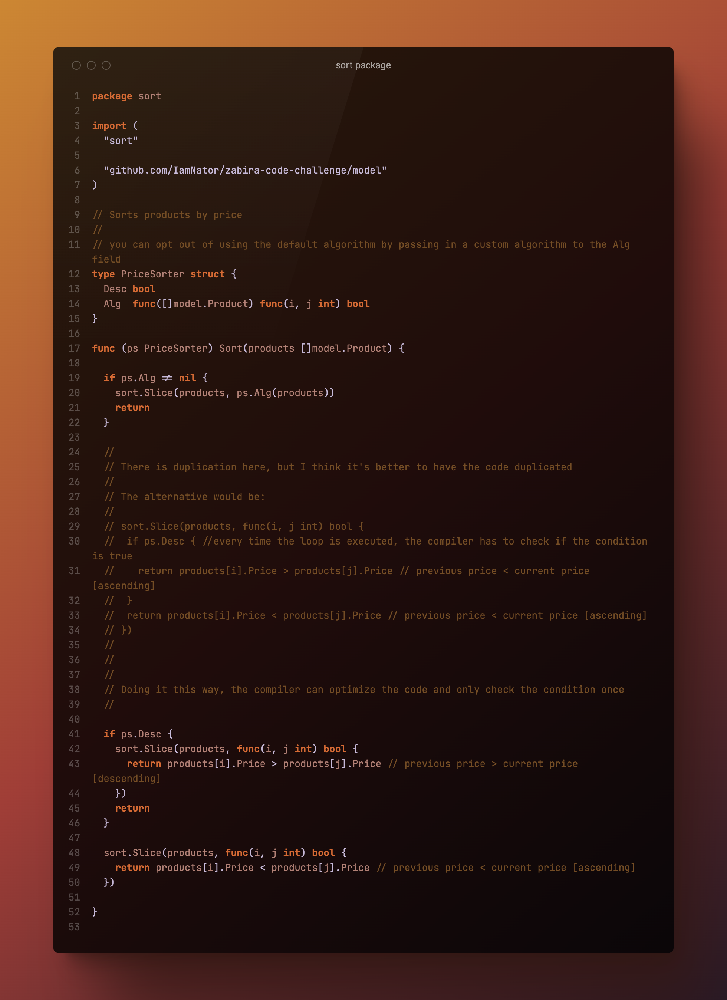

# zabira-code-challenge

### How to run

First Clone the repo with
```
    $ git clone git@github.com:IamNator/zabira-code-challenge.git
```
Then
```
    $ cd zabira-code-challenge/
```
Next, run the program [output](.github/images/run.png)
```
    $ go run main.go
```

### Testing
To run tests
```
    $ go test ./...
```


#### Running Bench Test
First navigate to the sort dir
```
    $ cd sort
```
Then, run bench test
```
    $ go test -bench=.
```


### Problem Statement

I was asked to create a sorting solution that is extensible so that different teams can easily add their own sorters without affecting existing code. 


### My Solution

Using an OOP approach, as demonstrated in my implementation, can make the code more modular and easier to extend. By creating an interface for sorters and implementing that interface in different sorter objects, the team can add new sorting algorithms without changing the existing code. This approach promotes code reuse and separates concerns, which can lead to a more maintainable and extensible codebase.

#### How I used the solution


#### Directory Tree

I created a `sort` packge to implement objects that fulfill the ProductSorter interface


#### `sort` Package

``` ./sort/sort.go```

The `sort` package includes code that helps sort products. It contains an interface called ProductSorter and provides ways to implement the interface.

In designing the ProductSorter interface in the sort package, I did not implement the singleton pattern because it was not necessary. The purpose of ProductSorter is to provide a simple and straightforward way to sort products, it does not work on external resources such as networks or files. 

<b>However</b>, if I had designed an interface that required access to external resources, such as a database or third-party client, then it would have been advisable to use the singleton pattern. This would ensure that only one instance of the interface exists throughout the application's lifecycle, preventing resource exhaustion or conflicts and allowing for efficient use of the external resource via dependency injection.


##### Sort by `Price`

``` ./sort/price.go```



##### Sort by Sales count to View count ration `sales:views`

``` ./sort/sales_view.go```


### Tests

#### Testing Sort by `Price`

``` ./sort/price_test.go```


#### Testing Sort by `sales:views` ratio

``` ./sort/sales_view_test.go```


